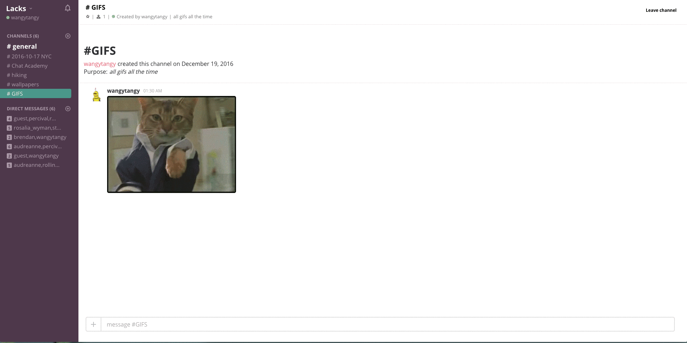

# Lacks

[Lacks live](https://lacks.herokuapp.com)

"Lacks" is a full stack, single-page, web application inspired by Slack, the group messaging app.
The backend utilizes a Ruby on Rails framework supported by a PostgreSQL database.
The frontend utilizes a Redux state container managed by the React JS library.
Live messaging between users and other updates is hosted by the Pusher API for realtime bi-directional communication via websockets.


## Features and Implementation

### Channel and Direct Messaging Maintenance

Channels and Direct Messages (DM's) are stored in the `channels` table:

  - `id`: primary key
  - `description`: description of the channel's purpose
  - `user_id`: foreign key pointing the creator of the channel
  - `direct_message_status`: boolean indicating whether the channel is a regular channel or DM

Channels and Direct Messages are the context in which chat messages are displayed. All channels are public and free to join by any user.

Users can search for existing channels or DMs to join or create their own channel.

Create channels:

Search channels and DMs:

Leaving a channel will remove the channel from the user's list of channels.

Deleting channels:

Channel deletion is a feature available only to its creator. Deleting a channel will permanently destroy the channel and its associated chat messages and images. Users subscribed to that channel will no longer be able to view it on their list of subscribed channels. Thanks to the use of Pusher, users affected by a channel deletion will see their list of channels live update to reflect the removal of that channel. This is accomplished by binding a 'trigger' to the Rails `channel#destroy` controller action on the server side.

```ruby
#channels_controller.rb
def destroy
  @channel = Channel.find(params[:id])

  if @channel
    @channel.destroy
    Pusher.trigger('channelIndex', 'leave_channel', "channel deleted")
    render :show
  else
    render json: ["channel not destroyed"], status: 404
  end
end
```
The `ChannelIndex` React component that holds their list of subscribed channels is then subscribed to that event on `componentDidMount`. When a user initiates a channel deletion, the component executes a callback function that performs a fresh AJAX request to re-fetch an updated list of their subscribed channels.
```javascript
//channel_index.jsx

componentDidMount() {
  //initiate a new Pusher instance:
  this.pusher = new Pusher('6229f47cce1a7e390f4e', {
    encrypted: true
  });

  //bind this.pusher to a channel
  let channelA = this.pusher.subscribe('channelIndex');
  channelA.bind('leave_channel', (data) => {
    console.log(data);
    //callbacks to execute:
    this.boundRedirectToGeneral();
    this.boundFetchAllChannels();
  });
}
```

Direct Messages are similar to channels but their content is only available to invited users and their "direct_message_status" column in the database is toggled to "true".

Users may leave direct messages, however they are re-subscribed to the direct message when new messages are posted. The users's list of direct messages will live update to reflect their active conversations.

### Live Chat (via Pusher)

Messages are stored in the `messages` table:

- `id`: primary key
- `body`: body of the chat message
- `author_id`: foreign key pointing the author of the message
- `channel_id`: foreign key pointing to which channel the messages belongs
- `image_file_name`
- `image_content_type`
- `image_file_size`
- `giphy_url`: url of GIF hosted on Giphy's library

Live chat messages are updated in realtime with the use of the Pusher API and websockets. Users' `CurrentChannel` component listens for new message creations in the `messages#create` controller action and adds the channel's newly created messages to the Redux state's slice of messages.

### Image Upload

Messages also support image upload with through the Paperclip gem and hosting by Amazon Web Services. Images source links are retrieved by extracting its url from the `image.url` property in the `Messages` table.

Image upload:


### Giphy Integration

The message table also includes the `giphy_url` column which holds a url of a randomly-fetched GIF from Giphy's library. Users can randomly generate a GIF from Giphy's library by posting a chat message starting with `/giphy`. GIFs can be filtered by adding an optional string to the chat message to retrieve GIFs by tags.


```javascript
//example Giphy query

$.ajax({
  method: "GET",
  url: `https://api.giphy.com/v1/gifs/random?api_key=${publicApiKey}${tagName}${rating}`,
  success: (response) => this.processGiphyResponse(response)
});
```

Sending GIFs:

### Future Directions for Lacks

These are the possible features that can be implemented on Lacks.

#### Notifications

Any messaging app would be incomplete without notifications. The Pusher API
could further aid in implementing a notifications feature that updates a messages counter when messages sent to channels belonging to the current user are not the current channel. Notifications would reset to zero on channel entry.

#### Online Status

Lacks needs to render a list of users who are currently online in order to facilitate true interactive messaging. To do this, there must be a way to keep track of multiple sessions and link them to user profiles. A show page of users also needs custom online/offline icons to reflect their login status.
